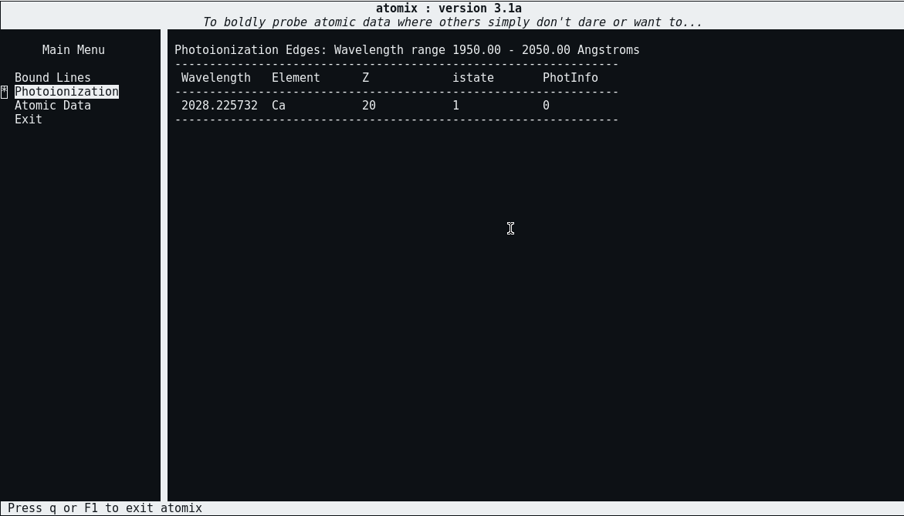

# atomix

The purpose of `atomix` is to allow a user to query the atomic data used in the
Monte Carlo Radiative Transfer and Ionization code 
[Python](https://github.com/agnwinds/python/).

It was made originally to try and decipher some of the mysterious spectral lines
and edges in the synthetic spectra created by Python for models of accretion 
disc winds in Tidal Disruption Events.



## Features

* Change the atomic data files on the fly
* Look at the bound-bound transitions over a provided wavelength range
* Find all the photoionization edges over a provided wavelength range
* Query the elements in the loaded data set
* Have a gander at the ions, or a specific ion

## Requirements, Building and Usage

`atomix` uses the [ncurses](https://en.wikipedia.org/wiki/Ncurses) library to
create a basic UI which is navigated using the keyboard. Python is required
to be installed and correctly configured, i.e. the `$PYTHON` environment 
variable is set, for `atomix` to work.

As of current `atomix` will, or should, work on both linux and macOS. For Linux,
please use the most up-to-date development version of `libncurses5-dev` and
`libncursesw5-dev`. On macOS, install the `ncurses` package in Homebrew (or your
other favourite package manager).

You can use CMake to build this program, usually as follows:

```bash
$ mkdir build
$ cd build
$ cmake ..
$ make
```

To use `atomix`, one simply has to invoke atomix from the command line. Please
see `atomix -h` for more information.

## TODO

Here are some of the current plans for future development:

* Improved and consistent UI design*
* Being able to resize the window without the background UI breaking 
* Other atomic features to search, i.e. levels

*If we are lucky ;-)
